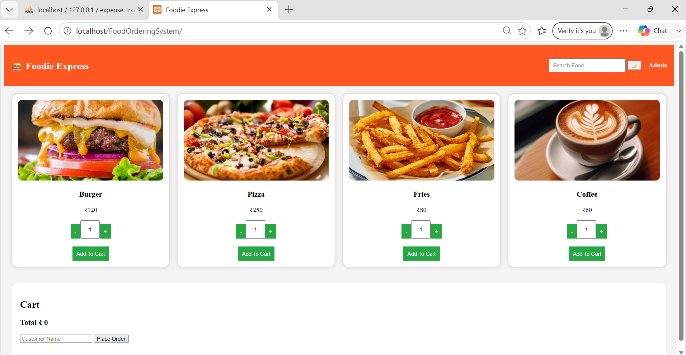
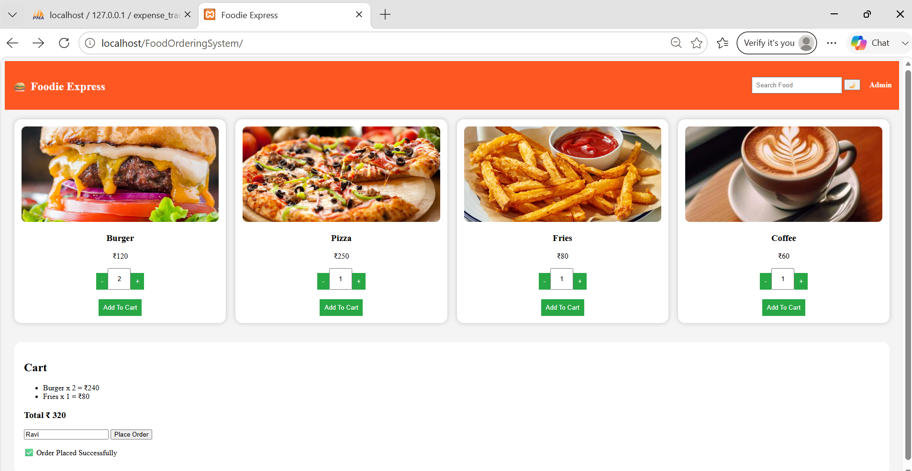
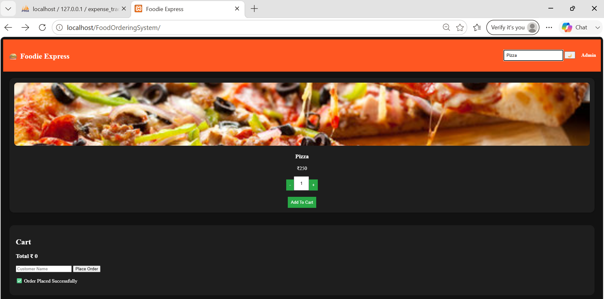
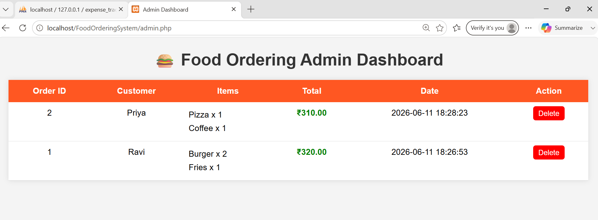
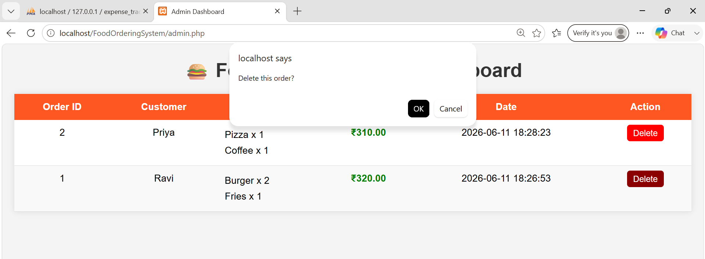
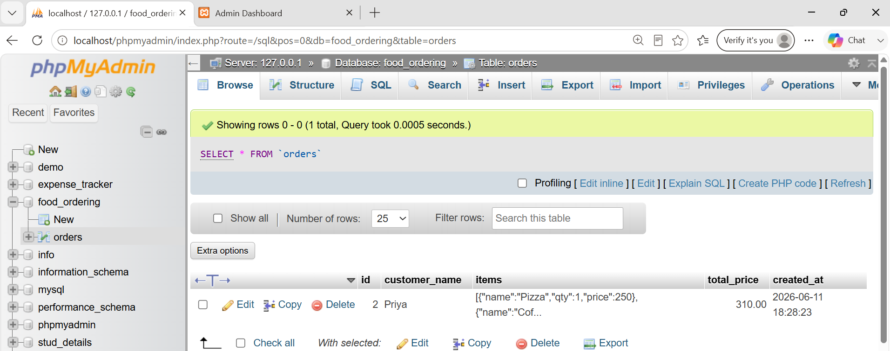

# Food Ordering System

A simple full-stack Food Ordering System developed using HTML, CSS, JavaScript, PHP, and MySQL.

## 🌐 Live Demo
**Live Website :** https://foodordersystem.infinityfreeapp.com
>Deployment: Deployed on **InfinityFree**

## 🚀 Features
- Browse food menu
- Search food items
- Place orders
- Adjust quantity
- Toggle Dark & Light mode
- Admin panel to view orders
- Delete orders
- Database integration using MySQL

## 🛠️ Tech Stack
- Frontend : HTML, CSS , JavaScript
- Backend  : PHP
- Database : MySQL
- XAMPP 

## 📂 Folder Structure
```
FoodOrderingSystem/
|
├── images/
│   ├── burger.jpg
│   ├── coffee.jpg
│   ├── fries.jpg
│   └── pizza.jpg
|
├── screenshots/
|
├── db.php
├── admin.php
├── place_order.php
├── delete_order.php
├── database.sql
├── index.html
├── style.css
└── script.js
└── README.md
```

## 📸 Screenshots
### Home Page

### Order Success

### Search Feature & Toggle Mode

### Admin Panel

### Delete Action

### Final Database Table


**⭐ If you found this project useful, consider giving it a star on GitHub !**
